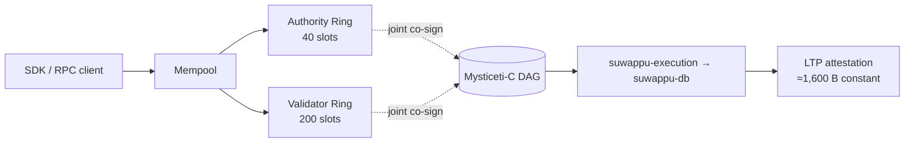
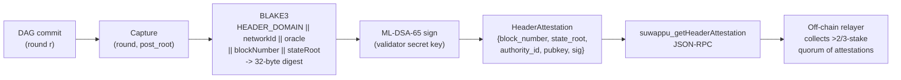

<div align="center">

# suwappu-dag

The **post-quantum settlement chain**. Joint-quorum BFT safety on a
Mysticeti-C certificate-DAG, constant-size cross-chain attestation,
and an execution substrate built to settle regulated assets.

[](https://github.com/Suwappu-Labs/suwappu-dag/actions)
[](https://github.com/Suwappu-Labs/suwappu-dag/releases)
[](./LICENSE)
[](./Cargo.toml)

[Quickstart](#quickstart) · [Architecture](#architecture) ·
[Repository map](#repository-map) · [Roadmap](./ROADMAP.md) ·
[Paper](https://github.com/Suwappu-Labs/suwappu-papers) ·
[Changelog](./CHANGELOG.md) · [Security](./SECURITY.md) ·
[Contributing](./CONTRIBUTING.md)

</div>

---

## Why suwappu-dag

`suwappu-dag` is the L1 of the **Suwappu Labs** — purpose-built
to clear cross-chain transfers under cryptography that survives the
post-quantum transition, with safety properties that survive single-ring
Byzantine corruption.

- **Quantum-resistant by default.** Every long-lived integrity surface
  uses NIST-standardized post-quantum primitives: **ML-DSA-65**
  (FIPS 204) for intent signing, **ML-KEM-768** (FIPS 203) for
  confidential transfer encryption. Classical-only chains migrate
  later; suwappu-dag ships PQ from day one.
- **Safety that survives a single-ring compromise.** Joint-quorum
  AND-gate (paper Theorem 2) requires Byzantine corruption of **both**
  a 40-slot Authority Ring **and** a 200-slot Validator Ring to fork
  the chain. No single ring is a single point of failure.
- **Constant-size cross-chain settlement.** Every LTP attestation
  commits **≈1,600 B regardless of payload** (paper §10.2) —
  ML-KEM-768 ciphertext (1,568 B) + BLS12-381 aggregate (96 B) +
  SHA3-256 root (32 B). Cross-chain cost stays bounded as volume grows.
- **Sub-second finality on the fast path.** Single-owner intents clear
  through a dedicated lane with **K=4 equivocation binding** and
  **100% bond slashing** for any Authority Node that signs a conflicting
  certificate (paper §6.4). Built for settlement, not speculation.
- **Paper-driven, proof-gated.** Every load-bearing claim is implemented
  by a named crate, traced to a specific paper section in the
  [visual map](docs/visuals/), and gated on **10,000-case property
  tests**. 20 sprints closed, 19 crates, 3 released phases.

### What this is NOT (yet)

- **Not on mainnet.** Current line is `0.x`; mainnet GA targets v1.0
  in the M18–M24 window (see [`ROADMAP.md`](./ROADMAP.md)).
- **No live token.** Devnet SUWAPPU is fungible test currency.
- **The execution substrate lives elsewhere.**
  [`suwappu-db`](https://github.com/Suwappu-Labs/suwappu-db) holds
  the polymorphic balance map, OCC scheduler, state tree, and dual-VM
  projectors; this repo is the *consensus + execution-adapter + bridge
  + L2* layer that wires it into a chain.

---

## Quickstart

Two paths — start with the public devnet unless you're changing the
validator itself. Full operator + developer details in
[`DEVNET.md`](./DEVNET.md).

### 1. Use the public devnet (recommended)

| Endpoint | URL |
|---|---|
| JSON-RPC | `https://rpc.devnet.suwappu.bot` |
| WebSocket | `wss://ws.devnet.suwappu.bot/ws` |
| Faucet | `https://faucet.devnet.suwappu.bot` |
| Explorer | `https://explorer.devnet.suwappu.bot` |
| Status | `https://status.devnet.suwappu.bot` |

```bash
# Drip 100 SUWAPPU to a fresh address (max 5 drips/hour per IP).
ADDR="0x$(openssl rand -hex 20)"
curl -X POST -H 'Content-Type: application/json' \
  -d "{\"address\":\"$ADDR\"}" \
  https://faucet.devnet.suwappu.bot/faucet

# Read epoch via JSON-RPC.
curl -sX POST https://rpc.devnet.suwappu.bot \
  -H 'content-type: application/json' \
  -d '{"jsonrpc":"2.0","id":1,"method":"suwappu_getEpoch","params":null}'
```

### 2. Run a local 4-node devnet (Docker)

```bash
git clone https://github.com/Suwappu-Labs/suwappu-dag.git
cd suwappu-dag
./scripts/devnet-local.sh up
```

The script generates per-validator keys + genesis under `target/devnet/`
and brings up 4 containers on a private network. JSON-RPC for `v0` is
exposed on `127.0.0.1:9092`. Tear down with `./scripts/devnet-local.sh down`.

```bash
curl -sX POST http://127.0.0.1:9092 -H 'content-type: application/json' \
  -d '{"jsonrpc":"2.0","id":1,"method":"suwappu_getEpoch","params":null}'
```

The full RPC surface is documented in
[`crates/suwappu-rpc/`](./crates/suwappu-rpc).

### SDKs

- Rust: [`clients/rust-sdk/`](./clients/rust-sdk)
- TypeScript: [`clients/ts-sdk/`](./clients/ts-sdk)
- End-to-end example: `cargo run -p suwappu-client --example submit_transfer`

---

## Architecture

suwappu-dag separates **consensus**, **execution**, and **cross-chain
attestation** into three crisply-bounded surfaces, then wires them
together with a single rule: every commit is the joint product of two
independently-bonded validator rings.

**Consensus (paper §6).** Authority Nodes propose intents and produce
Mysticeti-C certificates. The DAG store linearizes those certificates
into a totally-ordered commit stream under a commit rule whose orphan
window is property-tested at 10,000 cases. A single-owner fast-path
lane (paper §6.4) clears non-contested intents sub-second with K=4
equivocation binding — any Authority Node that double-signs forfeits
100% of bond.

**Execution (paper §7).** Each committed intent is applied to the
[`suwappu-db`](https://github.com/Suwappu-Labs/suwappu-db) substrate
via the `suwappu-execution` adapter. The substrate owns the polymorphic
balance map, OCC scheduler, state tree, and dual-VM projectors; this
repo owns the Intent surface that calls into it. Tokenomics (§3 / §4 /
§8) — inflation, delegation, slashing waterfall, withdrawal cooldown
— are implemented as state-transition arms on that substrate.

**Cross-chain (paper §10).** Every checkpoint is jointly co-signed by
the Authority and Validator Rings, then committed to LTP super-nodes
as a constant-size attestation. Other settlement venues observe these
attestations to recognize suwappu-dag state without re-running consensus.



Deep-dive visuals (interactive Mermaid + HTML, rendered from spec
numbers, not scaffolded charts):

- [DAG L1 internals](docs/visuals/suwappu-dag.html) ·
  [Substrate (suwappu-db)](docs/visuals/suwappu-db.html) ·
  [LTP attestation](docs/visuals/ltp.html)
- [Commit rule](docs/visuals/commit-rule.html) ·
  [Fast path + slashing](docs/visuals/fast-path-and-slashing.html) ·
  [Dual-VM projection](docs/visuals/dual-vm.html)
- [Governance flow](docs/visuals/governance-flow.html) ·
  [SCION transport](docs/visuals/scion-transport.html) ·
  [Ecosystem atlas](docs/visuals/suwappu-ecosystem-atlas.html)

---

## Repository map

19 crates, grouped by surface. Each entry cites the paper section it
implements where applicable.

### Consensus + cryptography

| Crate | Paper § | Owns |
|---|---|---|
| `suwappu-crypto` | §3.3, §10, §12 | ML-DSA-65, ML-KEM-768, BLS12-381, SHA3-256, Poseidon2 |
| `suwappu-consensus` | §6 | Mysticeti-C integration, certificate DAG, BFT linearization |
| `suwappu-fastpath` | §6.4 | Single-owner lane, K=4 equivocation binding |
| `suwappu-authority` | §5.1 | Authority Ring registry + certificate production |
| `suwappu-validator` | §5.2 | Validator Ring registry + ratification + slashing |

### Execution

| Crate | Paper § | Owns |
|---|---|---|
| `suwappu-execution` | §7 | Wires `suwappu-db` substrate into the DAG executor; Intent surface |
| `suwappu-precompiles` | §8 | Registered-issuer, DID, policy-vocabulary, reserve-coverage |
| `suwappu-mempool` | §7.2 | Mempool + tx-hash dedup + per-IP rate limit |

### Track G — L2 / ZK rollup (in flight)

| Crate | Paper § | Owns |
|---|---|---|
| `suwappu-l2-bridge` | §11 | L1 ↔ L2 deposit / withdraw / proof-verified state |
| `suwappu-l2-confidential` | §11.3 | Confidential-balance L2 surface (Track H integration) |
| `suwappu-l2-sequencer` | §11.2 | Sequencer mempool + batch builder + force-include |
| `suwappu-l2-verifier-precompile` | §11.4 | SP1 Groth16 BN254 verifier for L2 state-root commits |

### Cross-chain

| Crate | Paper § | Owns |
|---|---|---|
| `suwappu-ltp` | §10 | LTP attestation pipeline + super-node integration |

### Network, interface, operator

| Crate | Paper § | Owns |
|---|---|---|
| `suwappu-transport` | §6.3 | SCION path-authenticated gossip + RaptorQ shred/reconstruct |
| `suwappu-rpc` | — | JSON-RPC + WebSocket API |
| `suwappu-indexer` | — | Streaming Postgres indexer |
| `suwappu-faucet` | — | Devnet / testnet faucet service |
| `suwappu-validator-program` | — | Operator points-accumulator daemon |
| `suwappu-node` | — | Top-level binary, config, telemetry |

---

## Bridge attestation (source side)

When a SUWAPPU-DAG validator commits a round, the `suwappu-consensus` bridge-header
module captures the committed `(round, post_root)` and produces a
**validator-quorum side-attestation** — a signed claim that this validator's
local execution produced `state_root` at `block_number`. The destination bridge
oracle trusts an honest **>2/3-stake quorum** of these attestations; this is
sync-committee–class safety, not a consensus light client and not a
cryptographic source-state proof.

### Preimage and digest

The attestation signs a 32-byte **BLAKE3** digest of a 148-byte preimage
(`abi.encodePacked`-equivalent, byte-identical to the Solidity side):

```
HEADER_DOMAIN (32)  ||  networkId (32)  ||  oracle (20)
  ||  blockNumber-as-uint256-BE (32)  ||  stateRoot (32)
```

`HEADER_DOMAIN = keccak256("SUWAPPU_SUWAPPUDAG_HEADER_V1")` is hard-pinned as a
cross-language constant verified by tests on both the Rust and Solidity sides.
`stateRoot` is the suwappu-dag BLAKE3 L1 state root (`ExecutionReport::post_root`);
it is **not** an EVM-MPT root and is therefore **not** storage-provable — the
header is an opaque finalized-round anchor.

### Signing

Each validator holds an ML-DSA-65 (FIPS 204) keypair registered in genesis.
`HeaderAttestation::create` in `crates/suwappu-consensus/src/bridge_header.rs`
computes the digest and produces a detached ML-DSA-65 signature. The
`suwappu-mldsa-precompile` crate (in `crates/suwappu-mldsa-precompile/`) is
the ML-DSA-65 verify core used by the destination EVM (see `suwappu-revm`'s
`suwappu-revm` crate, address `0x0101`).

### RPC

The daemon (`crates/suwappu-node/src/daemon.rs`) exposes a
`suwappu_getHeaderAttestation` JSON-RPC that signs on demand and caches the latest
`HeaderAttestation` for the most recently committed round. An off-chain relayer
polls every validator's RPC endpoint, collects a set whose cumulative stake
exceeds the on-chain `>2/3` threshold, and submits the aggregated attestations
to the destination `SuwappuDagQuorumHeaderOracle`.

> **Honest framing.** The oracle/registry wiring into the mint path is not yet
> live; validators can produce and serve attestations via RPC, but the
> end-to-end bridge finalization path (`submitHeader` on the destination) is
> not yet wired to any production contract. The BLS12-381 aggregate used in the
> LTP layer (§10.2) is a separate system and is **classical, NOT
> post-quantum**. The ML-DSA-65 side-attestation described here is the only
> path that is post-quantum.

### Flow



The destination-side quorum verifier (in `suwappu-revm/crates/suwappu-revm/`) uses
native EVM precompiles `0x0102` (BLAKE3) and `0x0101` (ML-DSA-65) to verify
each attestation and finalize the header — the only configuration that is both
trust-minimized and post-quantum.

---

## Development

```bash
# Per-crate checks (workspace-wide commands can saturate low-RAM
# machines — see CONTRIBUTING.md for the rationale).
cargo fmt -p <crate>
cargo clippy -p <crate> --all-targets -- -D warnings
cargo test -p <crate>

# Sprint-closure exit gate: 10,000 proptest cases (release profile).
PROPTEST_CASES=10000 cargo test --release -p <crate>
```

CI runs the full workspace matrix (`rustfmt` / `clippy` / `test` /
`cargo-deny`) on every PR — push to a feature branch and let CI
validate. See [`CONTRIBUTING.md`](./CONTRIBUTING.md) for the PR
workflow, the local-vs-CI guidance, branch-naming conventions, and
DCO sign-off requirements.

Sprint cadence + collaboration contract are in
[`CLAUDE.md`](./CLAUDE.md). The dependency graph and per-sprint exit
gates are in
[`docs/architecture/sprint-map.md`](./docs/architecture/sprint-map.md).

---

## Status

- **Codebase**: pre-mainnet `0.x` line. Sprints DAG-S1 → DAG-S20 all
  closed; every sprint gated on 10,000-case proptest exit. 19 crates,
  3 released phases.
- **v0.3.0** (2026-05-18) — economic surface: per-slot stake,
  inflation, delegation, atomic slashing waterfall.
- **v0.2.0** — state surface: force-include, bridge whitelist,
  multi-chain VK registry, validator-set registries.
- **v0.1.0** — consensus + crypto + LTP attestation + SCION transport
  + full validator composition (DAG-S1 → DAG-S20).
- **Phase 4 — public devnet** in flight (4 regions; RPC + faucet +
  explorer + status). G1 apply-ready, G4 live; G2 / G3 / G5 / G6 /
  G7 / G8 tracked in
  [`ROADMAP.md`](./ROADMAP.md#phase-4--public-devnet-in-flight).
- **Phase 5 — incentivized testnet** next (Q3 2026, 7 regions,
  external operator points program).
- **Mainnet GA** targets v1.0 in the M18–M24 window.

Released versions:
[Releases page](https://github.com/Suwappu-Labs/suwappu-dag/releases).
Per-release scope: [`CHANGELOG.md`](./CHANGELOG.md).

---

## Specs & research

- **Academic specifications**:
  [`suwappu-papers`](https://github.com/Suwappu-Labs/suwappu-papers)
  (private repo — available on request). v8 DAG L1 paper
  (`suwappu_dag_l1_academic_v7.pdf`) + companion LTP paper
  (`suwappu_ltp_academic_v7.pdf`).
- **Architecture diagrams**: [`docs/visuals/`](docs/visuals/) —
  interactive Mermaid + HTML for the DAG, substrate, LTP commitment
  surface, fast path, dual-VM, governance flow, SCION transport, and
  the ecosystem atlas.
- **Investigation Questions (IQ docs)**: [`docs/iq/`](docs/iq/) —
  written ratifications for load-bearing decisions (quorum formula,
  indirect commit, fast-path architecture, decide_slot orphan window,
  bincode 2.x migration, L2 state-root commitment surface).
- **Sprint dependency graph**:
  [`docs/architecture/sprint-map.md`](./docs/architecture/sprint-map.md).

---

## Related repositories

| Repo | Role |
|---|---|
| [`suwappu-papers`](https://github.com/Suwappu-Labs/suwappu-papers) | v8 academic specs (DAG L1 + LTP) |
| [`suwappu-db`](https://github.com/Suwappu-Labs/suwappu-db) | Execution substrate (consumed here as workspace dep) |
| [`suwappu-lattice-protocol`](https://github.com/Suwappu-Labs/suwappu-lattice-protocol) | LTP bridge gateway |
| [`op-stack-reth`](https://github.com/Suwappu-Labs/op-stack-reth) | OP-stack reference fork (historical — Track G's L2 proof system has since moved to SP1 Groth16 BN254) |

---

## Supply chain

We practice continuous open-source dependency scanning and ship a
checked-in Software Bill of Materials (SBOM).

- **Checked-in SBOM.** A [CycloneDX](https://cyclonedx.org/) 1.5
  workspace-aggregate SBOM lives at
  [`sbom/suwappu-dag.cdx.json`](./sbom/suwappu-dag.cdx.json) — every
  dependency across all member crates, deduplicated.

  Every component is derived from `Cargo.lock` via
  [`cargo-cyclonedx`](https://github.com/CycloneDX/cyclonedx-rust-cargo);
  nothing is hand-authored. Each component carries a
  `pkg:cargo/<name>@<version>` purl.

  Regenerate the SBOM:

  ```sh
  cargo install --locked cargo-cyclonedx
  # Emits one <crate>.cdx.json next to each member Cargo.toml; the
  # aggregate sbom/suwappu-dag.cdx.json is the deduplicated union of those.
  cargo cyclonedx --format json --spec-version 1.5 --all --target all
  ```

- **CI workflows (SHA-pinned).** Two additive workflows live under
  `.github/workflows/`:
  - [`sbom.yml`](./.github/workflows/sbom.yml) — on each published
    Release, generates a CycloneDX SBOM with
    [Syft](https://github.com/anchore/syft) (via `anchore/sbom-action`,
    which reads `Cargo.lock`) and attaches it as a Release asset.
  - [`scorecard.yml`](./.github/workflows/scorecard.yml) — weekly +
    on push to `main`, runs [OpenSSF Scorecard](https://securityscorecards.dev/)
    and uploads SARIF to the repo Security tab.

  Both workflows pin every action to a full commit SHA. GitHub Actions
  billing is currently disabled for the org, so they are committed
  ready-to-run and activate automatically once billing is restored.

## Security

Found a vulnerability? **Don't open a public issue.** See
[`SECURITY.md`](./SECURITY.md) for the coordinated-disclosure process.

## License

Apache-2.0 — see [`LICENSE`](./LICENSE).
