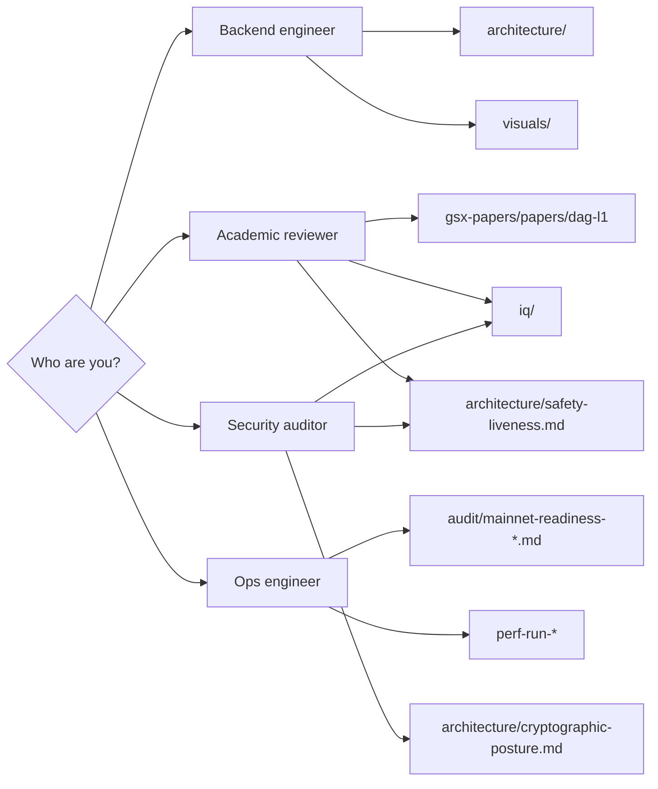
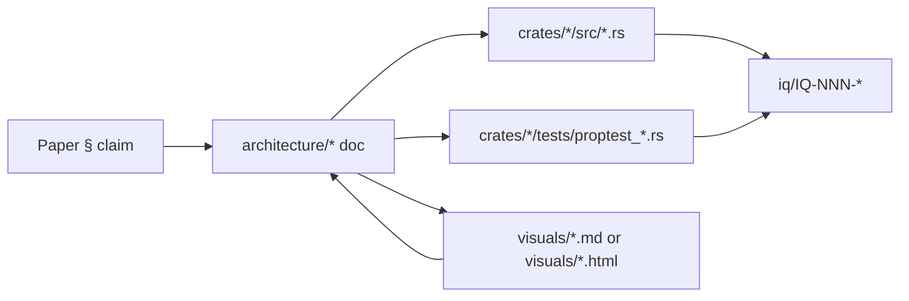

# GSX DAG documentation

Engineering documentation for the GSX DAG Layer 1 implementation, per the v8
academic paper *GSX DAG L1* (Natsagdorj, Calderon Jr., Mieskoski, Kirkley;
2026). The paper (in [`gsx-papers/papers/dag-l1`](https://github.com/GlobalSettlementNetwork/gsx-papers))
is the design spec; this directory is the engineering view.

> **Zero context?** Start with the [chain README](../README.md), then this
> page. The five-minute orientation is: read the README, scan
> [architecture/README.md](architecture/README.md), open
> [visuals/README.md](visuals/README.md) for the inline diagrams.

## Visuals

Every diagram is inline-rendered (Mermaid, native on GitHub + GitBook) in
[`visuals/README.md`](visuals/README.md). Standalone HTML presentations
(per-layer slide decks + ecosystem atlas) sit alongside in
[`visuals/`](visuals/) — see [visuals/index.html](visuals/index.html) for
the visual index.

## Where do I start?



### Reading orders

| Audience | Order |
|---|---|
| **Anyone wanting the 5-minute tour** | [../README.md](../README.md) → [visuals/README.md](visuals/README.md) → [architecture/overview.md](architecture/overview.md) |
| **Backend engineer joining cold** | [architecture/README.md](architecture/README.md) → [architecture/consensus.md](architecture/consensus.md) → [architecture/safety-liveness.md](architecture/safety-liveness.md) → `crates/gsx-node/src/daemon.rs` |
| **Consensus / cryptography reviewer** | [iq/README.md](iq/README.md) → [iq/IQ-001-quorum-formula.md](iq/IQ-001-quorum-formula.md) → [iq/IQ-002-indirect-commit.md](iq/IQ-002-indirect-commit.md) → [iq/IQ-004-decide-slot-orphan-window.md](iq/IQ-004-decide-slot-orphan-window.md) → [architecture/safety-liveness.md](architecture/safety-liveness.md) |
| **Ops / mainnet readiness reviewer** | [audit/mainnet-readiness-2026-05-14.md](audit/mainnet-readiness-2026-05-14.md) → [perf-run-2026-05-13/README.md](perf-run-2026-05-13/README.md) → [architecture/governance-phasing.md](architecture/governance-phasing.md) |
| **Security auditor** | [iq/README.md](iq/README.md) → [architecture/cryptographic-posture.md](architecture/cryptographic-posture.md) → [architecture/safety-liveness.md](architecture/safety-liveness.md) → invariant tests under `crates/*/tests/proptest_*.rs` |
| **LTP / cross-chain reviewer** | [architecture/super-node.md](architecture/super-node.md) → [architecture/ltp-integration.md](architecture/ltp-integration.md) → [gsx-lattice-protocol/docs/](https://github.com/GlobalSettlementNetwork/gsx-lattice-protocol/tree/main/docs) |

## Repository structure of `docs/`

```text
docs/
├── README.md                      this file
├── SUMMARY.md                     GitBook table of contents
│
├── architecture/                  section-mapped engineering docs
│   ├── README.md                  index → 14 sections mapped to paper §§4–14
│   ├── overview.md                §4 — four-layer stack on a single chain
│   ├── validator-rings.md         §5 — Authority + Validator rings
│   ├── consensus.md               §6 — Mysticeti-C DAG + commit rule
│   ├── transport.md               §6.3 — SCION + RaptorQ
│   ├── fast-path.md               §6.4 — single-owner lane + K-binding
│   ├── execution.md               §7 — dual VM over polymorphic balance map
│   ├── gsx-db-bridge.md           §7 — workspace-dep boundary to gsx-db substrate
│   ├── application.md             §8 — precompiles (DID, issuer, reserve)
│   ├── super-node.md              §9 — 7-of-9 super-node role
│   ├── ltp-integration.md         §10 — LTP commit/lattice/materialize
│   ├── safety-liveness.md         §11 — joint-quorum AND-gate (Theorem 2)
│   ├── cryptographic-posture.md   §12 — PQ posture + exception zones
│   ├── governance-phasing.md      §14 — Phase G2 → G3 → G4
│   └── sprint-map.md              sprint dependency DAG + exit-gate registry
│
├── iq/                            Investigation Questions (decision records)
│   ├── README.md                  IQ index + ratification posture
│   ├── IQ-001-quorum-formula.md   quorum integer encoding (ratified)
│   ├── IQ-002-indirect-commit.md  indirect commit rule (ratified)
│   ├── IQ-003-fast-path-architecture.md  fast-path lane (pending)
│   └── IQ-004-decide-slot-orphan-window.md  parent-set freeze gap (pending)
│
├── audit/                         point-in-time audit snapshots
│   └── mainnet-readiness-2026-05-14.md
│
├── perf-run-2026-05-12/           perf-testnet snapshot — 6-region
│   └── README.md
├── perf-run-2026-05-13/           perf-testnet snapshot — extended campaign
│   └── README.md
│
└── visuals/                       diagram set (canonical source: this repo)
    ├── README.md                  inline-rendered Mermaid (GitHub + GitBook native)
    ├── SOURCE-OF-TRUTH.md         cross-repo duplication policy (PR-4)
    ├── index.html                 standalone visual index
    ├── gsx-ecosystem-atlas.html   single-page ecosystem map
    ├── gsx-dag.html               GSX DAG slide
    ├── gsx-db.html                GSX DB slide
    ├── ltp.html                   LTP slide
    ├── mermaid/                   Mermaid source files (canonical text format)
    └── excalidraw/                hand-drawn dark-mode canvases (auxiliary)
```

## How the docs cross-reference

Every load-bearing claim in the academic paper maps to an architecture
doc, which maps to a `proptest_*.rs` exit gate, which references the IQ
that sanctioned the design choice (if one exists). Pick any node in the
chain and you can walk to the others without context loss.



## Status snapshot

| Surface | Status | Reference |
|---|---|---|
| Sprints S1–S20 (Phase 1 invariants) | ✅ closed; 5 invariants verified at 10k cases each | [architecture/sprint-map.md](architecture/sprint-map.md) |
| Post-S20 backlog (S21–S33+) | In progress; perf + governance + JSON-RPC + indexer landed | [architecture/sprint-map.md](architecture/sprint-map.md#post-s20-backlog), CLAUDE.md |
| IQ-001 + IQ-002 ratification | ✅ ratified 2026-05-14 ([gsx-papers#1](https://github.com/GlobalSettlementNetwork/gsx-papers/pull/1)) | [iq/README.md](iq/README.md) |
| IQ-003 fast-path architecture | Pending sign-off | [iq/IQ-003-fast-path-architecture.md](iq/IQ-003-fast-path-architecture.md) |
| IQ-004 decide_slot orphan window | Pending sign-off; tracking [#45](https://github.com/GlobalSettlementNetwork/gsx-dag/issues/45) | [iq/IQ-004-decide-slot-orphan-window.md](iq/IQ-004-decide-slot-orphan-window.md) |
| Mainnet readiness audit | Snapshot 2026-05-14 | [audit/mainnet-readiness-2026-05-14.md](audit/mainnet-readiness-2026-05-14.md) |

## Sister repos

- [`gsx-db`](https://github.com/GlobalSettlementNetwork/gsx-db) — execution substrate (polymorphic balance map, dual-VM, anchor pipeline). Consumed here as a workspace dependency. See [architecture/gsx-db-bridge.md](architecture/gsx-db-bridge.md).
- [`gsx-lattice-protocol`](https://github.com/GlobalSettlementNetwork/gsx-lattice-protocol) — LTP runtime (Commit / Lattice / Materialize). The `gsx-dag/crates/gsx-ltp` crate carries the on-chain attestation surface; the LTP runtime sits in this sibling repo. See [architecture/ltp-integration.md](architecture/ltp-integration.md).
- [`gsx-papers`](https://github.com/GlobalSettlementNetwork/gsx-papers) — academic paper sources (LaTeX) for *GSX DAG L1* and *LTP*.

All three sibling repos cross-link to `gsx-dag/docs/visuals/` as the
canonical home for the visual stack.
