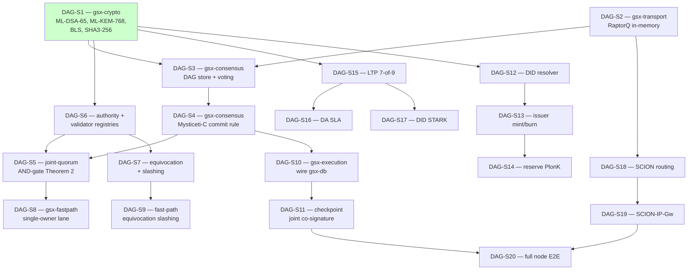

# Sprint map

Implementation sprints for `gsx-dag`. Each sprint closes a load-bearing
invariant via a 10,000-case property test.

## Dependency graph

S1 closed. All others queued.

## Sprint exit gates

| Sprint | Crate | Module | Exit-gate property |
|---|---|---|---|
| DAG-S1 ✅ | gsx-crypto | (lib) | 7 properties × 10k cases (sign/verify, encap/decap, aggregate, domain-sep) |
| DAG-S2 | gsx-transport | `raptorq` | `raptorq_reconstructs_under_loss` |
| DAG-S3 | gsx-consensus | `dag`, `cert` | `dag_topological_order_unique` |
| DAG-S4 | gsx-consensus | `commit_rule` | `mysticeti_c_finality` |
| DAG-S5 | gsx-consensus | `joint_quorum` | `joint_quorum_safety` (Theorem 2) |
| DAG-S6 | gsx-authority, gsx-validator | `registry`, `quorum` | `quorum_math_matches_paper` |
| DAG-S7 | gsx-authority, gsx-validator | `slashing` | `equivocation_proof_slashes` |
| DAG-S8 | gsx-fastpath | `cert`, `binding` | `fast_path_main_lane_consistency` |
| DAG-S9 | gsx-fastpath | `slashing` | `fast_path_equivocation_full_slash` |
| DAG-S10 | gsx-execution | (lib) | `block_execution_matches_substrate` |
| DAG-S11 | gsx-execution | `checkpoint` | `joint_state_commitment_signed` |
| DAG-S12 | gsx-precompiles | `did` | `did_document_validates` |
| DAG-S13 | gsx-precompiles | `issuer` | `issuer_mint_burn_atomic` |
| DAG-S14 | gsx-precompiles | `reserve` | `reserve_coverage_predicate` |
| DAG-S15 | gsx-ltp | `attestation` | `seven_of_nine_attestation` |
| DAG-S16 | gsx-ltp | `da_sla` | `da_sla_enforced` |
| DAG-S17 | gsx-ltp | `did_stark` | `did_stark_round_trip` |
| DAG-S18 | gsx-transport | `scion` | `scion_path_auth` |
| DAG-S19 | gsx-transport | `scion_ip_gw` | `gateway_fallback_correctness` |
| DAG-S20 | gsx-node | (binary) | `node_runs_genesis_block` (E2E) |

## Phase gates

| Phase | Sprints | Outcome |
|---|---|---|
| Phase A: foundations | DAG-S1, S2 | Crypto + transport primitives sealed |
| Phase B: consensus | DAG-S3 → S9 | Mysticeti-C + dual-ring + fast-path with slashing |
| Phase C: execution | DAG-S10, S11 | gsx-db wired in; checkpoint co-signature live |
| Phase D: application | DAG-S12 → S14 | Precompiles for identity + issuance + reserve |
| Phase E: cross-chain | DAG-S15 → S17 | LTP attestation + DA SLA + DID STARK |
| Phase F: transport hardening | DAG-S18, S19 | SCION integration |
| Phase G: launch | DAG-S20 | Full validator binary, E2E genesis block |

## Phase-1 invariants — full list

The chain enforces these at every Mysticeti round:

1. **Joint-quorum AND-gate** (DAG-S5) — safety violation requires Byzantine
   corruption of both rings simultaneously.
2. **PQ-conservative crypto surface** (DAG-S1) — long-lived confidentiality
   surfaces use NIST PQC primitives.
3. **Constant-size LTP commitment** (DAG-S15) — every LTP attestation commits
   ≈1,600 B regardless of payload.
4. **Substrate invariants** (DAG-S10) — `gsx-db` invariants inherited
   bit-for-bit through the block executor.
5. **Fast-path equivocation slashing** (DAG-S9) — 100% bonded stake +
   expulsion on any fast-path equivocation by an Authority Node.

Each is a 10k-case property test.
