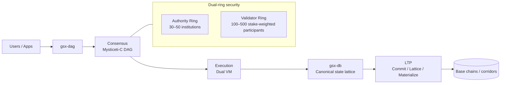
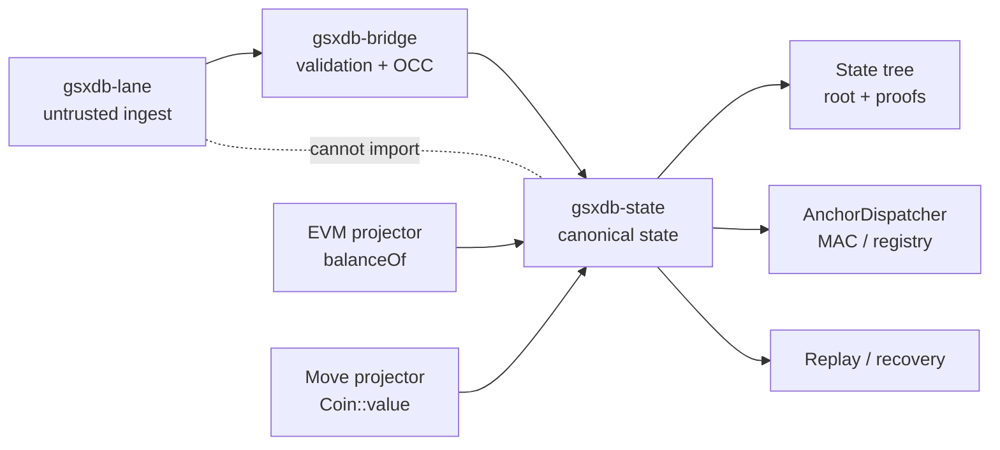
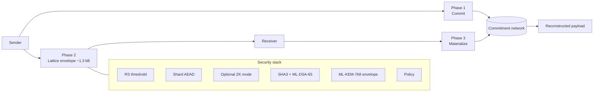

# GSX visuals

Inline-rendered diagrams of the three GSX stack layers. Mermaid blocks
below render natively on GitHub and GitBook (no plugin required). For
the standalone presentation-style HTML pages, see
[`index.html`](./index.html) — opened in a browser they include
keyboard navigation, dark-mode styling, and the
[ecosystem atlas](./gsx-ecosystem-atlas.html).

## GSX DAG — chain architecture

Mysticeti-C certificate DAG, dual-ring security (Authority + Validator),
dual-VM execution, and LTP transfer-and-attestation surface.

Source: [`mermaid/gsx-dag.md`](./mermaid/gsx-dag.md) ·
[`excalidraw/gsx-dag.excalidraw`](./excalidraw/gsx-dag.excalidraw) ·
[presentation](./gsx-dag.html)

## GSX DB — canonical state lattice

Sealed mutation pipeline: untrusted ingest (`gsxdb-lane`) cannot import
into canonical state; only `gsxdb-bridge` mediates after validation +
OCC. Read projectors (EVM `balanceOf`, Move `Coin::value`) attach to
the canonical state without bypassing the bridge.

Source: [`mermaid/gsx-db.md`](./mermaid/gsx-db.md) ·
[`excalidraw/gsx-db.excalidraw`](./excalidraw/gsx-db.excalidraw) ·
[presentation](./gsx-db.html)

## LTP — transfer-and-attestation layer

Three-phase Commit → Lattice → Materialize lifecycle. The Lattice
envelope is constant-size (~1.3 kB) regardless of payload, satisfying
the paper §10.2 invariant. The security stack stacks RS threshold +
shard AEAD + optional ZK + SHA3 + ML-DSA-65 + ML-KEM-768 envelope +
policy.

Source: [`mermaid/ltp.md`](./mermaid/ltp.md) ·
[`excalidraw/ltp.excalidraw`](./excalidraw/ltp.excalidraw) ·
[presentation](./ltp.html)

## Ecosystem atlas

The full GSX ecosystem — DAG L1, the dual-VM execution substrate, LTP
attestation, the tokenization studio, the issuance/banking surface,
and the dev-net corridor — is collected in
[`gsx-ecosystem-atlas.html`](./gsx-ecosystem-atlas.html) (presentation
only).

## Notes

- Mermaid sources live under [`mermaid/`](./mermaid/) and are the
  canonical text-native source; HTML pages render the same content
  with extra styling.
- Excalidraw sources under [`excalidraw/`](./excalidraw/) are
  hand-drawn dark-mode canvases for live visual editing.
- [`mermaid/iq7-hybrid-auth.md`](./mermaid/iq7-hybrid-auth.md) is a
  draft hybrid-authentication flow exploration; not yet promoted to a
  presentation page.
