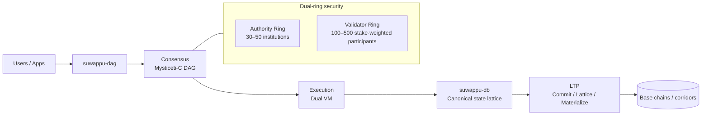
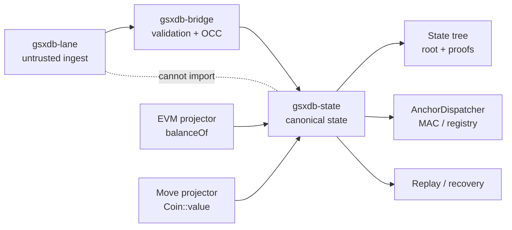
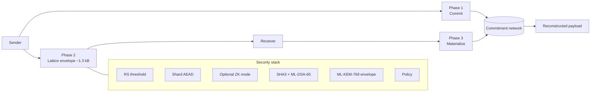
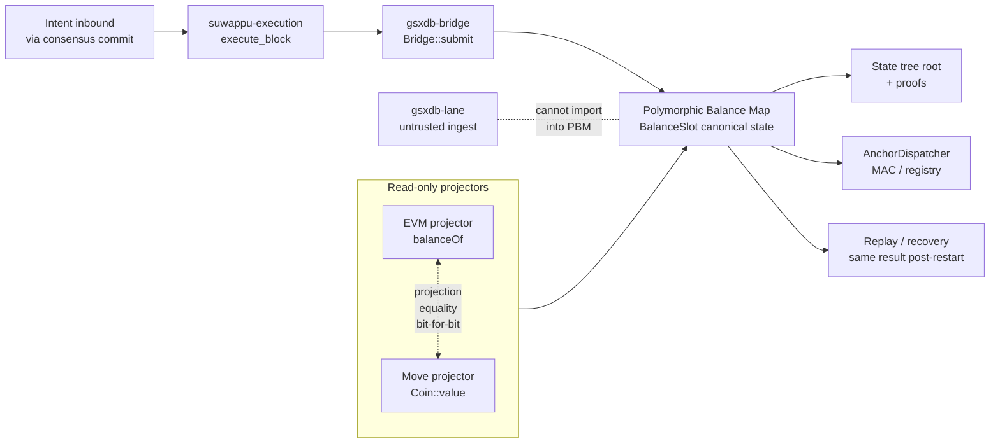
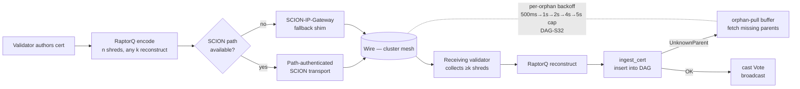

# SUWAPPU visuals

Inline-rendered diagrams covering the SUWAPPU stack. Mermaid blocks below
render natively on GitHub and GitBook (no plugin required). For the
standalone presentation-style HTML pages with extra styling and
keyboard navigation, see [`index.html`](./index.html) — that also lists
the [ecosystem atlas](./suwappu-ecosystem-atlas.html) and the five
consensus deep-dives.

> **Canonical source:** Mermaid (this README + sources under
> [`mermaid/`](./mermaid/)). HTML presentations are auxiliary slide
> decks that load the same Mermaid sources via CDN. Excalidraw sources
> are retained in [`excalidraw-archive/`](./excalidraw-archive/) for
> reference only — they're not synced with Mermaid going forward.

## Stack layers

### Suwappu DAG — chain architecture

Mysticeti-C certificate DAG, dual-ring security (Authority + Validator),
dual-VM execution, and LTP transfer-and-attestation surface.



Source: [`mermaid/suwappu-dag.md`](./mermaid/suwappu-dag.md) ·
[presentation](./suwappu-dag.html) ·
[architecture/overview.md](../architecture/overview.md)

### SUWAPPU DB — canonical state lattice

Sealed mutation pipeline: untrusted ingest (`gsxdb-lane`) cannot import
into canonical state; only `gsxdb-bridge` mediates after validation +
OCC. Read projectors (EVM `balanceOf`, Move `Coin::value`) attach to
the canonical state without bypassing the bridge.



Source: [`mermaid/suwappu-db.md`](./mermaid/suwappu-db.md) ·
[presentation](./suwappu-db.html) ·
[architecture/suwappu-db-bridge.md](../architecture/suwappu-db-bridge.md)

### LTP — transfer-and-attestation layer

Three-phase Commit → Lattice → Materialize lifecycle. The Lattice
envelope is constant-size (~1.3 kB) regardless of payload, satisfying
the paper §10.2 invariant. The security stack stacks RS threshold +
shard AEAD + optional ZK + SHA3 + ML-DSA-65 + ML-KEM-768 envelope +
policy.



Source: [`mermaid/ltp.md`](./mermaid/ltp.md) ·
[presentation](./ltp.html) ·
[architecture/ltp-integration.md](../architecture/ltp-integration.md)

## Consensus deep dives

### Mysticeti-C commit rule

Direct + indirect commit rule with the IQ-004 parent-set freeze window.
Covers `crates/suwappu-consensus/src/commit.rs` end-to-end.

```mermaid
flowchart TB
    R[Round R<br/>leader cert authored<br/>by leader(R, n)]
    R1[Round R+1<br/>peer authors propose<br/>parent set = local DAG R-certs]
    Q{Distinct authors at R+1<br/>citing leader_hash as parent<br/>≥ quorum_threshold(n)?}
    Direct[LeaderStatus::Direct<br/>commit + drain block]
    Anchor[Search anchor at R' ≥ R+2<br/>directly decided]
    InHist{leader cert in<br/>causal_history(anchor)?}
    Skip[LeaderStatus::Skip<br/>permanently dropped<br/>one-shot intent lost]
    Late[Late-arriving leader cert<br/>via orphan-pull]
    IQ4[IQ-004 fix candidates:<br/>A late-arrival re-decide<br/>B wait-for-leader timer<br/>C author-buffered duplicates]

    R --> R1
    R1 --> Q
    Q -->|yes| Direct
    Q -->|no| Anchor
    Anchor --> InHist
    InHist -->|yes| Direct
    InHist -->|no| Skip
    Late -. arrives AFTER R+1<br/>parent-set frozen .- Q
    Skip -. mitigated by .- IQ4
```

Source: [`mermaid/commit-rule.md`](./mermaid/commit-rule.md) ·
[presentation](./commit-rule.html) ·
[architecture/safety-liveness.md](../architecture/safety-liveness.md) ·
IQs [001](../iq/IQ-001-quorum-formula.md) ·
[002](../iq/IQ-002-indirect-commit.md) ·
[004](../iq/IQ-004-decide-slot-orphan-window.md)

### Fast path + equivocation slashing

Single-owner lane, K-binding cross-check against the main-lane index,
100% slashing on equivocation. Paper §6.4 + DAG-S8/S9 exit gates.

```mermaid
flowchart LR
    Client[Client submits<br/>single-owner intent] --> Lane[Fast-path lane<br/>K-of-N owner-binding cert]
    Lane -->|K=4 confirmations| Ack[Client receives ack<br/>1-RTT commit confirmation]
    Lane --> Cross{K-binding cross-check<br/>vs main_lane_index<br/>(populated by try_commit)}
    Cross -->|consistent| Final[Fast-path cert<br/>safe to spend]
    Cross -->|conflict<br/>in K-window| Equiv[EquivocationProof<br/>two fast-path certs<br/>same owner, same nonce]
    Equiv --> Slash[100% bonded stake<br/>+ Authority Ring expulsion]
    subgraph MainLane[Main-lane fallback]
      MLane[Same intent flows<br/>through Mysticeti-C DAG]
      MLane --> Commit[Block commit<br/>main_lane_index updated]
    end
    Cross -.- MLane
```

Source: [`mermaid/fast-path-and-slashing.md`](./mermaid/fast-path-and-slashing.md) ·
[presentation](./fast-path-and-slashing.html) ·
[architecture/fast-path.md](../architecture/fast-path.md) ·
[IQ-003](../iq/IQ-003-fast-path-architecture.md)

### Governance flow — Phase G2

Signed wire (ML-DSA-65, #28) → commit → `pending_governance` queue →
epoch boundary drain (#18) → registry mutation → deferred activation on
first-cert ingest (#32). Paper §14, DAG-S25 + post-S25 hot-fixes.

```mermaid
flowchart LR
    Op[Authority operator<br/>signs intent with ML-DSA-65<br/>see #28] --> Wire[Client wire verify_signed_intent<br/>rejects unsigned/forged before mpsc]
    Wire --> Intent[Intent: AdmitAuthority /<br/>ExitAuthority / EjectAuthority]
    Intent --> Block[Lands in proposed block]
    Block --> Commit[Block committed via decide_slot]
    Commit --> Queue[pending_governance.push intent<br/>at try_commit — NOT applied yet]
    Queue --> Boundary{Epoch boundary<br/>at cert_round?}
    Boundary -->|no| Wait[Wait next round]
    Wait --> Queue
    Boundary -->|yes #18| Drain[Drain queue]
    Drain --> Apply[apply_governance_intent for each]
    Apply -->|AdmitAuthority| AdmReg[registries grow to n+1<br/>pending_stake parks stake<br/>n_authorities UNCHANGED]
    Apply -->|Exit/Eject| RemReg[registries shrink<br/>n_authorities = registry.len]
    AdmReg --> NewCert{First cert from<br/>new authority?}
    NewCert -->|yes #32| Activate[pending_stake → stake_table<br/>n_authorities += 1<br/>new voter active]
    NewCert -->|no, still pending| AdmReg
```



Source: [`mermaid/governance-flow.md`](./mermaid/governance-flow.md) ·
[presentation](./governance-flow.html) ·
[architecture/governance-phasing.md](../architecture/governance-phasing.md)

### Dual-VM execution — projection equality

EVM and Move read the same `BalanceSlot`; `balanceOf(addr)` and
`Coin::value(addr)` agree bit-for-bit at every committed block. Single
writer (`gsxdb-bridge`). Substrate invariants inherited from suwappu-db.



Source: [`mermaid/dual-vm.md`](./mermaid/dual-vm.md) ·
[presentation](./dual-vm.html) ·
[architecture/execution.md](../architecture/execution.md) ·
[architecture/suwappu-db-bridge.md](../architecture/suwappu-db-bridge.md)

### SCION transport + RaptorQ

Path-authenticated routing with IP-Gateway fallback, RaptorQ
fountain-coded shred/reconstruct, per-orphan backoff in the orphan-pull
recovery (DAG-S32). Paper §6.3.



Source: [`mermaid/scion-transport.md`](./mermaid/scion-transport.md) ·
[presentation](./scion-transport.html) ·
[architecture/transport.md](../architecture/transport.md)

## Cross-cutting

- [**SUWAPPU Ecosystem Atlas (HTML)**](./suwappu-ecosystem-atlas.html) — single-page atlas of the full SUWAPPU stack: DAG L1, the dual-VM execution substrate, LTP attestation, the tokenization studio, and ecosystem geometry. Best viewed in a browser; the page is a hand-drawn SVG and doesn't have a Mermaid equivalent.
- [**Auth dispatch (Mermaid, draft)**](./mermaid/auth-dispatch.md) — the suwappu-db IQ-7 anchor hybrid AND-gate (`AuthScheme` discriminant + ECDSA + ML-DSA-65). Not yet promoted to an HTML presentation; useful for reading alongside the substrate's anchor pipeline.

## Notes

- **Canonical sources** live in [`mermaid/`](./mermaid/). HTML
  presentations (`*.html`) embed the same Mermaid via CDN — edit
  Mermaid, not HTML.
- **Excalidraw** sources are archived in
  [`excalidraw-archive/`](./excalidraw-archive/). They were the
  earliest visual format; the Mermaid + inline-rendered README is the
  canonical home going forward. Retained for hand-editing workflows.
- **Cross-repo:** the same `docs/visuals/` tree is bit-identically
  mirrored in `suwappu-lattice-protocol` so the LTP repo can render the
  diagrams offline. Drift is detected by
  `scripts/check-visuals-parity.sh` (added in a follow-up PR).
  Source-of-truth policy: edit here first, mirror manually until the
  parity-check job runs in CI on both repos.
