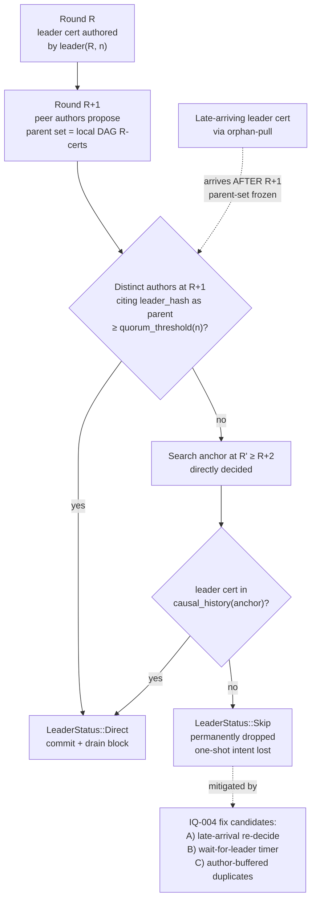

# DagBft-C commit rule — direct + indirect + orphan window

Covers `crates/suwappu-consensus/src/commit.rs` end-to-end: `try_direct_decide`,
`try_indirect_decide`, `decide_slot`, `causal_history`. Highlights the
parent-set freeze window that [IQ-004](../../iq/IQ-004-decide-slot-orphan-window.md)
catches.

## Notes

- Honest commit path: a healthy round-R cert + ≥`quorum_threshold(n)`
  distinct supporters at R+1 finalizes via the direct rule.
  `quorum_threshold(n) = n − ⌊(n−1)/3⌋` per [IQ-001](../../iq/IQ-001-quorum-formula.md).
- Indirect path ([IQ-002](../../iq/IQ-002-indirect-commit.md)): if R is
  Undecided, scan for an anchor at R' ≥ R+2 that is directly decided;
  walk its `causal_history` to determine R's outcome.
- Orphan window ([IQ-004](../../iq/IQ-004-decide-slot-orphan-window.md)):
  if the leader's R cert is delivered to a peer *after* that peer has
  proposed at R+1, the leader is not in R+1's parent set. Orphan-pull
  delivers the cert into the DAG but `causal_history` (which walks
  parents) never reaches it from any later anchor. The slot is
  permanently `Skip` and any one-shot intent it carried vanishes.
- Joint-quorum gate (not shown — handled in `joint.rs`): the
  Validator Ring also has to co-sign before the candidate cert
  finalizes. This is paper Theorem 2's AND-gate.
