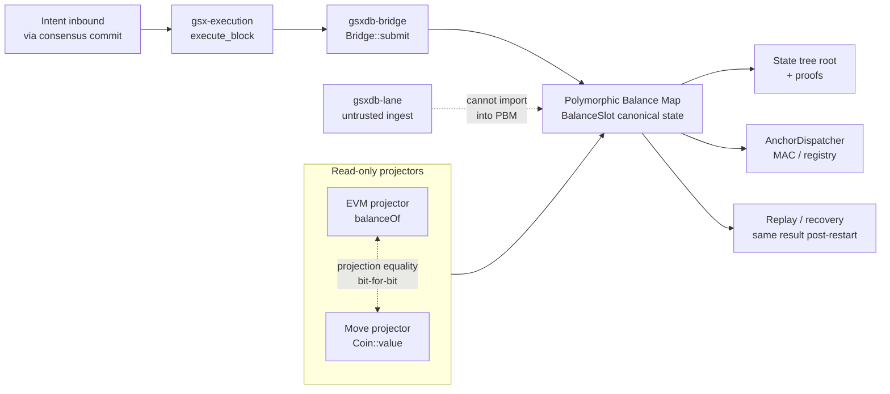

# Dual-VM execution — EVM ↔ Move projection equality

Covers the execution-layer integration between `gsx-execution` and the
`gsx-db` substrate. Paper §7. Substrate invariants live in
[`gsx-db`](https://github.com/GlobalSettlementNetwork/gsx-db); this
diagram shows the chain-side seam.

## Notes

- **Single writer:** only `gsxdb-bridge::Bridge::submit` (and the
  `BlockExecutor` invoked from `execute_block`) write to the
  `BalanceStore`. `gsxdb-lane` ingests untrusted intents and stages
  them but cannot reach into canonical state — this is the lane
  separation invariant (gsx-db Invariant 1).
- **Dual-VM projection equality (Invariant 2 in gsx-db):** EVM and
  Move read the same `BalanceSlot`. `balanceOf(addr)` and
  `Coin::value(addr)` agree at every committed block — `proptest`
  property `dual_projection_equality_holds` in gsx-db enforces this
  at 10k cases.
- **Replay equivalence (Invariant 7 in gsx-db):** recovery replay
  reapplies the committed blocks from the anchor pipeline and
  produces the same state tree root.
- **Why the chain inherits these:** gsx-execution is a thin adapter;
  the substrate invariants travel through unchanged. See
  [`architecture/gsx-db-bridge.md`](../../architecture/gsx-db-bridge.md)
  for the full integration boundary writeup.
