# Governance flow — Phase G2 (current)

Covers `crates/gsx-node/src/daemon.rs::apply_governance_intent` end-to-end,
the `pending_governance` queue (#18), and the `pending_stake` deferred-
activation site (#32). Paper §14. Closed in DAG-S25 + the post-S25 hot-fix
chain.

```mermaid
flowchart LR
    Op["Authority operator<br/>signs intent with ML-DSA-65<br/>(#28)"] --> Wire["Client wire verify_signed_intent<br/>rejects unsigned/forged before mpsc"]
    Wire --> Intent["Intent: AdmitAuthority /<br/>ExitAuthority / EjectAuthority"]
    Intent --> Block["Lands in proposed block"]
    Block --> Commit["Block committed via decide_slot<br/>(see commit-rule visual)"]
    Commit --> Queue["pending_governance.push(intent)<br/>at try_commit — NOT applied yet"]
    Queue --> Boundary{"Epoch boundary<br/>at cert_round?"}
    Boundary -->|"no"| Wait["Wait next round"]
    Wait --> Queue
    Boundary -->|"yes (#18)"| Drain["Drain queue"]
    Drain --> Apply["apply_governance_intent for each"]
    Apply -->|"AdmitAuthority"| AdmReg["registries grow to n+1<br/>pending_stake parks stake<br/>n_authorities UNCHANGED"]
    Apply -->|"Exit / Eject"| RemReg["registries shrink<br/>n_authorities = registry.len"]
    AdmReg --> NewCert{"New authority's first cert<br/>ingests via ingest_cert?"}
    NewCert -->|"yes (#32)"| Activate["pending_stake.remove → stake_table<br/>n_authorities += 1<br/>NOW the new voter is active"]
    NewCert -->|"no, still pending"| AdmReg
```

## Notes

- **Why ML-DSA-65 on the wire (#28):** every governance intent must be
  signed by a key seated in the Authority Ring. The client listener
  verifies the signature before pushing to the `pending_intents` mpsc;
  unsigned or forged intents never reach consensus.
- **Why queue at commit, drain at boundary (#18):** applying governance
  the instant a block commits caused inter-daemon drift — each daemon
  mutates its `n_authorities` at a different round, transitional
  quorum thresholds disagree, commits stall. Queueing in
  `pending_governance` and draining atomically at the next epoch
  boundary makes the mutation cluster-wide simultaneous.
- **Why defer the activation bump (#32):** if `n_authorities` jumped
  the moment AdmitAuthority committed, the quorum denominator inflates
  before the new authority can actually vote — `quorum_threshold(n+1)`
  becomes unreachable for the existing nodes and the chain stalls.
  Parking stake in `pending_stake` and bumping `n_authorities` only on
  the new authority's first ingested cert (in `ingest_cert`) avoids
  this. See the
  `bft-stake-denominator-deadlock-on-admit` operator skill.
- **Interaction with IQ-004:** the governance intent rides in a single
  cert. If that cert lands in the `decide_slot` orphan window
  ([IQ-004](../../iq/IQ-004-decide-slot-orphan-window.md)), the
  intent vanishes from the commit pipeline and the registries never
  mutate. Current test-side mitigation: client resubmits every 5s
  (PR #44). Real fix tracked in #45.
