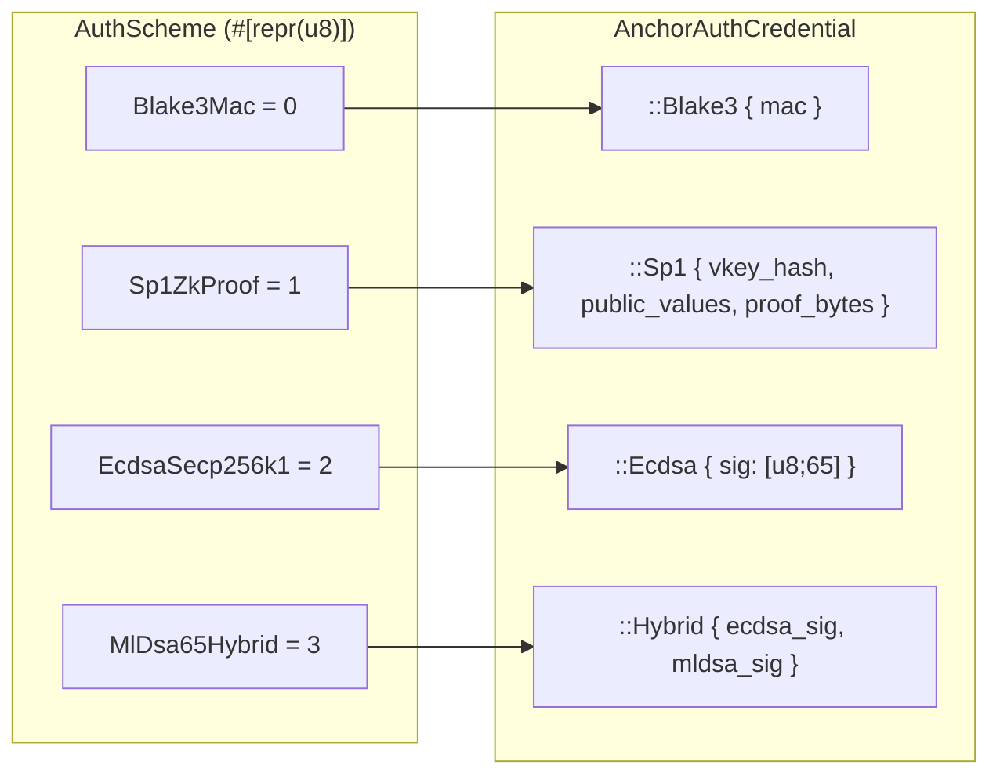
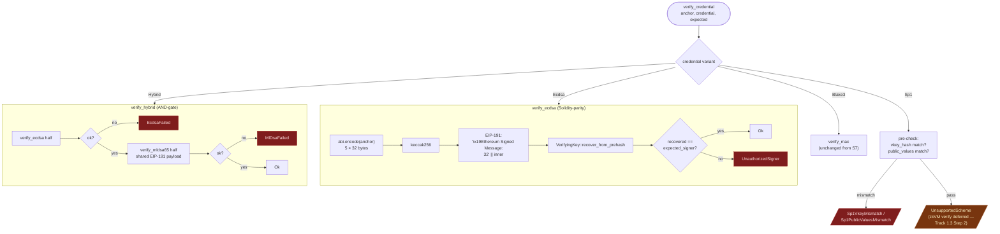

# IQ-7 Anchor Auth — Hybrid AND-gate

Landed by `gsx-db` PR #4 (anchor/iq7-scheme-alignment).

## AuthScheme + credential envelope

## verify_credential dispatch

## Parity-critical invariants

- **ECDSA payload** is byte-exact vs. `LTPAnchorRegistry.recoverSigner` —
  same `abi.encode` field layout, same EIP-191 prefix bytes, same
  `ecrecover` semantics.
- **Low-s** signatures rejected on both sides (EIP-2 malleability) —
  Rust via `Signature::normalize_s().is_some()`, Solidity via
  `uint256(s) <= secp256k1n/2`.
- **v-byte strict** on both sides — only `{27, 28}` accepted (no
  silent `v += 27` bump).
- **`production-pqc` feature off** → ML-DSA verifier is a stub that
  returns `UnsupportedScheme`. Hybrid credential cannot accidentally
  validate without the PQ build.
- **Sp1 pre-check vs verify** — even when structural pre-checks pass,
  the arm returns `UnsupportedScheme(Sp1ZkProof)`. Pre-check success
  is never mistaken for full verification.

## Discriminant table

| Variant            | u8 |
|--------------------|----|
| `Blake3Mac`        | 0  |
| `Sp1ZkProof`       | 1  |
| `EcdsaSecp256k1`   | 2  (reuses the old `PostQuantumSig` slot) |
| `MlDsa65Hybrid`    | 3  (new) |

Pinned by `auth_scheme_discriminants_are_stable` in
`crates/gsxdb-bridge/src/anchor/types.rs`. Renaming a variant or
reordering would break wire-format compatibility with serialized
anchors.

## Outstanding follow-ups (knowingly deferred)

| Item | Tracked in | When |
|---|---|---|
| `AnchorDispatcher` wiring for ECDSA / Hybrid | `types.rs` doc comments | Track 1.2 Steps B-D, S11 |
| Sp1 cryptographic proof verification | `credential.rs:418` | Track 1.3 Step 2 (zkVM toolchain decision) |
| 36-pair conformance matrix coverage of new variants | `docs/architecture/sprint-execution-checklist.md` | S11 exit gate |
| `Anchor::hash` includes `auth_scheme` byte; Solidity `hashAnchor` does not | parity-checker review | S11 (paired ABI fix) |
