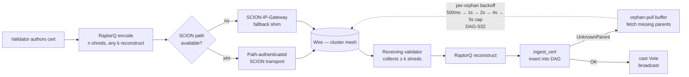

# SCION transport — path-authenticated routing + RaptorQ shred/reconstruct

Covers `crates/gsx-transport/` end-to-end: RaptorQ in-memory
(DAG-S2 exit gate), SCION path auth (DAG-S18), SCION-IP-Gateway fallback
(DAG-S19). Paper §6.3.

## Notes

- **RaptorQ fountain code (S2):** payload is encoded into more shreds
  than strictly needed; any `k` distinct shreds reconstruct the source
  bit-exactly. Decouples delivery success from packet loss.
  `proptest_reconstruction.rs` × 10k cases.
- **SCION path auth (S18):** when the network supports SCION, paths
  are explicitly authenticated by the originating validator's
  path-segment certificates. `proptest_scion.rs` × 10k cases.
- **IP-Gateway fallback (S19):** if no native SCION path is
  available, the gateway shim carries the same shred set over plain
  IP with an equivalent authentication shim.
  `proptest_gateway.rs` × 10k cases.
- **Per-orphan backoff (S32):** the orphan-pull recovery has
  exponential backoff per missing-cert hash, so a slow consumer
  doesn't suffer a retry storm. See the
  `dag-orphan-pull-retry-storm-without-per-orphan-backoff` operator
  skill.
